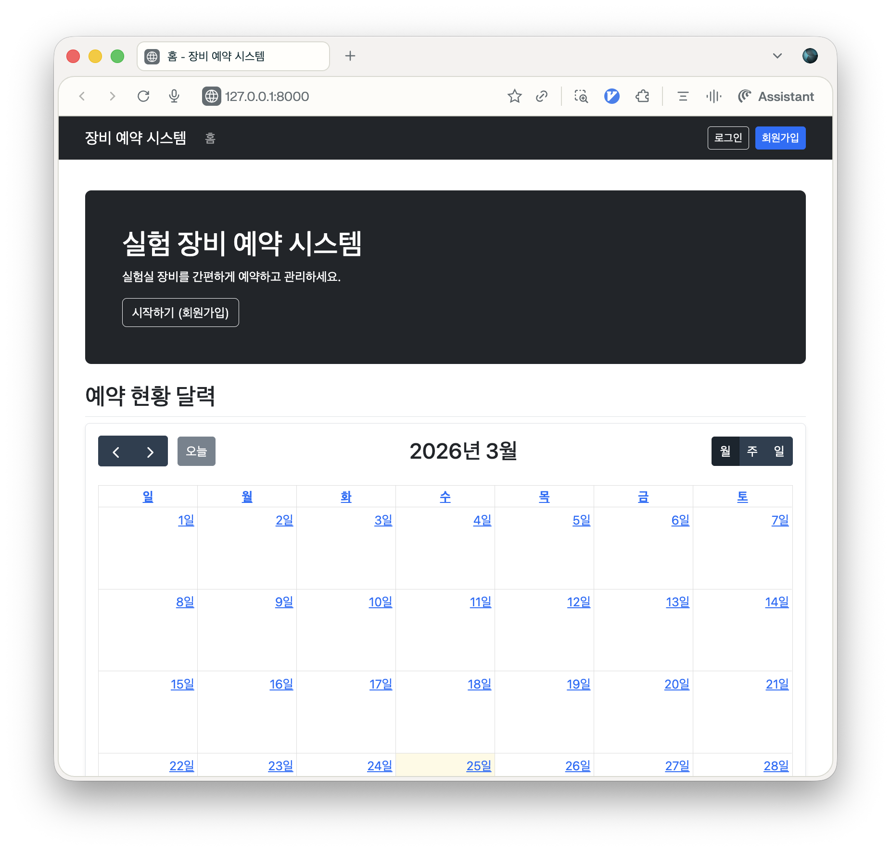

# 실험 장비 예약 시스템



실험실 장비 예약 시스템을 구축하기 위한 저장소입니다.

## 개발 환경 설정

이 프로젝트는 `uv`를 사용하여 의존성을 관리합니다.

### 요구 사항

- Python 3.12+
- [uv](https://github.com/astral-sh/uv)

### 설치 방법

```bash
# 저장소 복제
git clone <repository-url>
cd EquipmentReserv

# 가상환경 생성 및 의존성 설치
uv sync
```

### 서버 실행

```bash
uv run python manage.py runserver
```
